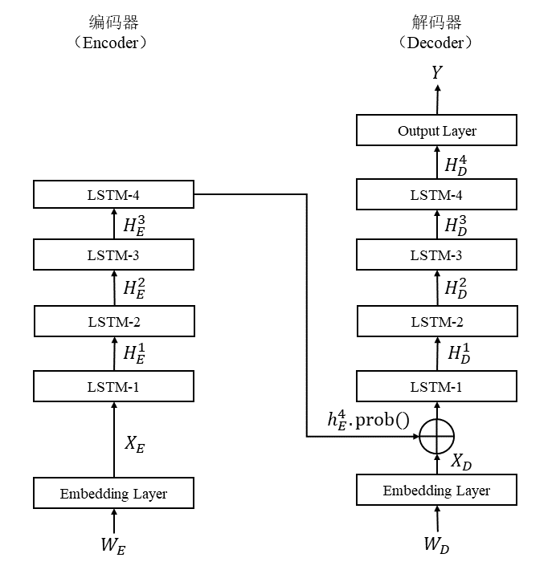
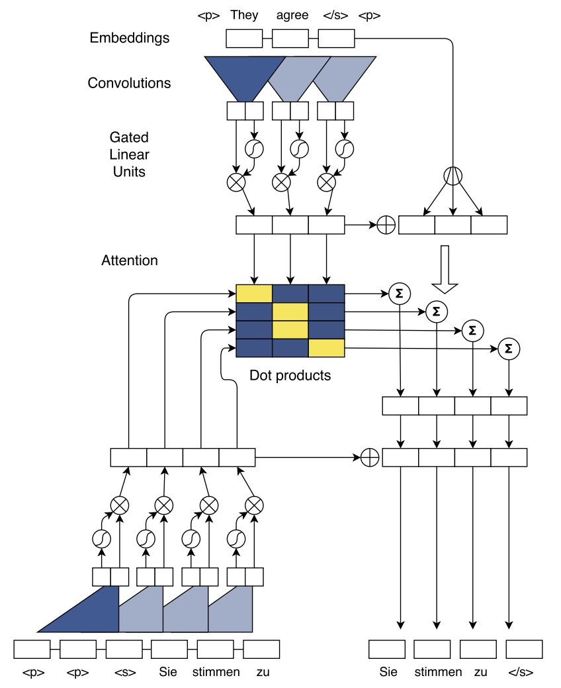
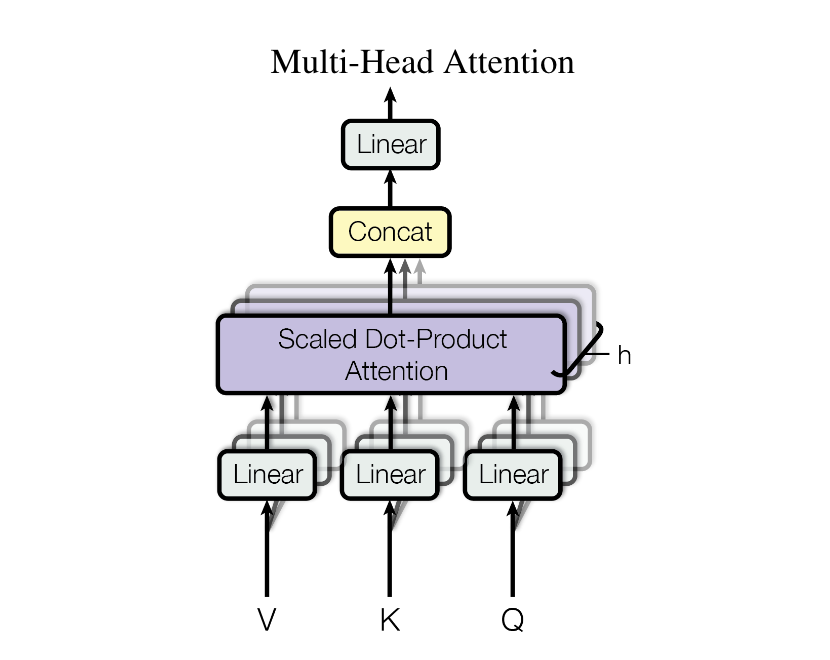

# 第26章序列到序列模型

## 习题26.1
&emsp;&emsp;设计由4层LSTM组成的序列到序列的基本模型，写出其公式。

**解答：**  

**解答思路：**

1. 给出序列到序列的基本模型
2. 设计基于4层LSTM的编码器和解码器，绘制模型架构图
3. 结合模型架构图，写出模型公式
4. 自编程实现模型

**解答步骤：**  

**第1步：序列到序列的基本模型**

&emsp;&emsp;根据书中第484页序列到序列的基本模型：
> &emsp;&emsp;对于序列到序列基本模型，编码器和解码器是循环神经网络，通常是LSTM和GRU。  
> 编码器的状态是
$$
h_j = a(x_j, h_{j - 1}), \ j = 1, 2, \cdots, m
$$
> 解码器的状态是
$$
s_i = a(y_{i - 1}, s_{i - 1}), \ i = 1, 2, \cdots, n
$$
> 解码器的输出是
$$
p_i = g(s_i), \ i = 1, 2, \cdots, n
$$
> 编码器的最终状态$h_m$是解码器的初始状态$s_0$。
> $$
s_0 = h_m
$$

**第2步：设计基于4层LSTM的编码器和解码器，绘制模型架构图**



**第3步：结合模型架构图，写出模型公式**

&emsp;&emsp;对于编码器部分，输入为 $W_E$，经过嵌入层编码得 $X_E$，再经过4层 LSTM 编码，可得

$$
X_E = \text{Embedding} (W_E) \\
H_E^1 = \text{Encoder LSTM1} (X_E) \\
H_E^2 = \text{Encoder LSTM2} (H_E^1) \\
H_E^3 = \text{Encoder LSTM3} (H_E^2) \\
H_E^4 = \text{Encoder LSTM4} (H_E^3)
$$

&emsp;&emsp;取最后一层的输出 $\boldsymbol H_E^4$ 中最终状态 $\boldsymbol h_E^4$，通过广播机制扩展至与解码器输入序列相同维度，进行拼接

$$
X_D = \text{Embedding} (W_D) \\
H_D^1 = \text{Decoder LSTM1} ([X_D, h_E^4.\text{prob()}]) \\
H_D^2 = \text{Decoder LSTM2} (H_D^1) \\
H_D^3 = \text{Decoder LSTM3} (H_D^2) \\
H_D^4 = \text{Decoder LSTM4} (H_D^3) \\
Y = \text{Output}(H_D^4)
$$

**第4步：自编程实现模型**


```python
import torch
from torch import nn
import numpy as np
```


```python
class S2SEncoder(nn.Module):
    r"""Info: 由LSTM组成的序列到序列编码器。

    Args:
        inp_size: 嵌入层的输入维度。
        embed_size: 嵌入层的输出维度。
        num_hids: LSTM 隐层向量维度。
        num_layers: LSTM 层数，本题目设置为4。
    """
    def __init__(self, inp_size, embed_size, num_hids,
                num_layers, dropout=0, **kwargs):
        super(S2SEncoder, self).__init__(**kwargs)
        
        self.embed = nn.Embedding(inp_size, embed_size)
        self.rnn = nn.LSTM(embed_size, num_hids, num_layers,
                          dropout=dropout)

    def forward(self, inputs):
        # inputs.shape(): (seq_length, embed_size)
        inputs = self.embed(inputs)

        # output.shape(): (seq_length, num_hids)
        # states.shape(): (num_layers, num_hids)
        output, state = self.rnn(inputs)

        return output, state
```


```python
class S2SDecoder(nn.Module):
    r"""Info: 由LSTM组成的序列到序列解码器。

    Args:
        inp_size: 嵌入层的输入维度。
        embed_size: 嵌入层的输出维度。
        num_hids: LSTM 隐层向量维度。
        num_layers: LSTM 层数，本题目设置为4。
    """
    def __init__(self, inp_size, embed_size, num_hids,
                num_layers, dropout=0, **kwargs):
        super(S2SDecoder, self).__init__(**kwargs)
        self.num_layers = num_layers
        self.embed = nn.Embedding(inp_size, embed_size)
        # 解码器 LSTM 的输入，由目标序列的嵌入向量和编码器的隐层向量拼接而成。
        self.rnn = nn.LSTM(embed_size + num_hids, num_hids, num_layers,
                          dropout=dropout)

        self.linear = nn.Linear(num_hids, inp_size)

    def init_state(self, enc_outputs, *args):
        return enc_outputs[1][-1]

    def forward(self, inputs, state):
        # inputs.shape(): (seq_length, embed_size)
        inputs = self.embed(inputs)

        # 广播 context，使其具有与 inputs 相同的长度
        # context.shape(): (seq_length, num_layers, embed_size)
        context = state[-1].repeat(inputs.shape[0], 1, 1)
        inputs = torch.cat((inputs, context), 2)
        # output.shape(): (seq_length, num_hids)
        output, _ = self.rnn(inputs)

        output = self.linear(output)

        return output
```


```python
class EncoderDecoder(nn.Module):
    r"""Info: 基于 LSTM 的序列到序列模型。

    Args:
        encoder: 编码器。
        decoder: 解码器。
    """
    def __init__(self, encoder, decoder, **kwargs):
        super(EncoderDecoder, self).__init__(**kwargs)
        self.encoder = encoder
        self.decoder = decoder

    def forward(self, enc_inp, dec_inp):
        enc_out = self.encoder(enc_inp)
        dec_state = self.decoder.init_state(enc_out)

        return self.decoder(dec_inp, dec_state)
```


```python
# 搭建一个4层LSTM构成的序列到序列模型，进行前向计算
inp_size, embed_size, num_hids, num_layers = 10, 8, 16, 4
encoder = S2SEncoder(inp_size, embed_size, num_hids, num_layers)
decoder = S2SDecoder(inp_size, embed_size, num_hids, num_layers)
model = EncoderDecoder(encoder, decoder)
```


```python
enc_inp_seq = "I love you !"
dec_inp_seq = "我 爱 你 ！"
enc_inp, dec_inp = [], []

# 自己构造的的词典
word2vec = {"I": [1, 0, 0, 0], 
              "love": [0, 1, 0, 0],
              "you": [0, 0, 1, 0],
              "!": [0, 0, 0, 1],
              "我": [1, 0, 0, 0],
              "爱": [0, 1, 0, 0],
              "你": [0, 0, 1, 0],
              "！": [0, 0, 0, 1]}

for word in enc_inp_seq.split():
    enc_inp.append(word2vec[word])

enc_inp = torch.tensor(enc_inp)

for word in dec_inp_seq.split():
    dec_inp.append(word2vec[word])
    
dec_inp = torch.tensor(dec_inp)
output = model(enc_inp, dec_inp)
```

## 习题26.2
&emsp;&emsp;比较基本模型和RNN Search的异同。

**解答：**

**解答思路：**

1. 给出基本模型
2. 给出RNN Search模型
3. 比较基本模型和RNN Search的异同

**解答步骤：**   

**第1步：基本模型**

&emsp;&emsp;根据书中第484页序列到序列的基本模型：
> 对于序列到序列基本模型，编码器和解码器是循环神经网络，通常是LSTM和GRU。  
> 编码器的状态是
$$
h_j = a(x_j, h_{j - 1}), \ j = 1, 2, \cdots, m
$$
> 解码器的状态是
$$
s_i = a(y_{i - 1}, s_{i - 1}), \ i = 1, 2, \cdots, n
$$
> 解码器的输出是
$$
p_i = g(s_i), \ i = 1, 2, \cdots, n
$$
> 编码器的最终状态$h_m$是解码器的初始状态$s_0$。
> $$
s_0 = h_m
$$

**第2步：RNN Search模型**

&emsp;&emsp;根据书中第484\~485页RNN Search模型：
> &emsp;&emsp;RNN Search模型用双向LSTM实现编码，用单向LSTM实现解码，用注意力实现编码器到解码器的信息传递。在输出单词序列的每一个位置，通过注意力搜索到输入单词序列中的相关内容，以影响下一个位置的单词生成。  
> &emsp;&emsp;编码器的状态是
> $$
h_j^{(1)} = a \left( x_j, h_{j - 1}^{(1)} \right), \ j = 1, 2, \cdots, m \\
h_j^{(2)} = a \left( x_j, h_{j + 1}^{(2)} \right), \ j = m, m - 1, \cdots, 1 \\
h_j = [h_j^{(1)};h_j^{(2)}], \ j = 1, 2, \cdots, m
$$
> 解码器的状态是
> $$
s_i = a (y_{i - 1}, s_{i - 1}, c_i), \ i = 1, 2, \cdots, n
$$
> 解码器的输出是
> $$
p_i = g(s_i), \ i = 1, 2, \cdots, n
$$
> 通过注意力计算上下文向量$c_i$。注意力的查询是前一个位置的状态$s_{i - 1}$，键和值是编码器的各个位置上的中间表示$h_j$。
> $$
c_i = \sum_{j = 1}^m \alpha_{ij} h_j, \ i = 1, 2, \cdots, n \\
\alpha_{ij} = \frac{\exp(e_{ij})}{\sum_{k - 1}^m \exp (e_{ik})}, \ i = 1, 2, \cdots, n, \ j = 1, 2, \cdots, m \\
e_{ij} = \sigma(w^T \cdot [s_{i - 1}; h_j] + b), \ i = 1, 2, \cdots, n, \ j = 1, 2, \cdots, m
$$

**第3步：比较基本模型和RNN Search的异同**

- 相同点：
    1. 两者都由编码器和解码器组成，编码器和解码器都是循环神经网络
    2. 两者都能解决序列到序列的学习任务，属于序列到序列模型

- 不同点：
    1. 编码器：RNN Search的编码器使用双向LSTM，将各个位置对正向和反向状态进行拼接，得到中间表示；基本模型仅使用单向RNN。
    2. 解码器：RNN Search使用单向LSTM，在解码器的每一个位置，通过加法注意力计算上下文向量，在解码的过程中，将编码器得到的状态序列或中间表示序列通过注意力有选择地传递到解码器，决定解码器的状态序列，以及输出的单词序列。基本模型使用单向RNN，编码器将其最终状态作为整个输入单词序列的表示传递给解码器。

## 习题26.3
&emsp;&emsp;写出多头自注意力的对损失函数的求导公式。

**解答：**

**解答思路：**  

1. 给出多头注意力的计算公式
2. 给出多头自注意力的计算公式
3. 写出多头自注意力的对损失函数的求导公式

**解答步骤：**   

**第1步：多头注意力的计算公式**

&emsp;&emsp;根据书中第478页多头注意力：
> &emsp;&emsp;多头是指多个并行的注意力。在多头注意力中，先通过线性变换将表示向量从所在的空间分别投影到多个不同的子空间，每个子空间对应一个头，接着在各个子空间分别进行注意力计算，之后将各个子空间的注意力计算结果进行拼接，最后再对拼接结果进行线性变换，得到的表示向量的维度与原来的表示向量的维度相同。  
> &emsp;&emsp;设$Q$是查询矩阵，$K$是键矩阵，$V$是值矩阵。多头注意力multi_attend的计算是
> $$
\text{multi\_attend} (Q, K, V) = W_o \cdot \text{concate} (U_1, U_2, \cdots, U_h) \\
U_i = \text{attend} \left( W_Q^{(i)} Q, W_K^{(i)} K, W_V^{(i)} V \right), \ i = 1, 2, \cdots, h  
$$
> 其中，$h$是头的个数，$U_i$是第$i$个头的注意力计算结果，concate是矩阵向量的拼接，$W_O$是线性变换矩阵。$W_Q^{(i)}, W_K^{(i)}, W_V^{(i)}$分别是第$i$个头的查询矩阵、键矩阵、值矩阵的线性变换矩阵，attend是注意力函数。

**第2步：多头自注意力的计算公式**

&emsp;&emsp;根据书中第479页多头自注意力的描述：
> &emsp;&emsp;当注意力中的查询、键、值向量$Q,K,V$相同，或者说自己时，称为自注意力。多头自注意力是有多个头的自注意力。  
> &emsp;&emsp;在解码器中，多头自注意力计算对之后的位置进行掩码处理，让这些位置不参与计算。具体导入矩阵$M$，自注意力计算变成以下的掩码自注意力计算：
> $$
\text{attend} (Q, K, V) = V \cdot \text{softmax} \left( \frac{K^T \cdot Q + M}{\sqrt{d_k}} \right) \\
M = [m_{ij}], m_{ij} = \left \{  
\begin{array}{ll}
0, & i \leqslant j \\
-\infty, & \text{其他}
\end{array}
\right.
$$
> 也就是说，自注意力在每一个位置以该位置的表示向量作为查询向量，该位置和之前位置的所有表示向量作为键向量和值向量。掩码注意力保证了解码的过程是自回归的，学习时可以使用强制教学的方法，即训练在各个位置上并行进行。

**第3步：写出多头自注意力的对损失函数的求导公式**

&emsp;&emsp;假设有某个 $N$ 层的 Transformer 模型，损失函数为$L$，第 $l$ 层的输入为 $X^{(l-1)}$，其中第 $i$ 个的头注意力层输出为 $Z_i$，可得：

$$
Q_i^{(l)} = W^{(l)}_{i,q} X^{(l-1)} \\
K_i^{(l)} = W^{(l)}_{i,k} X^{(l-1)} \\ 
V_i^{(l)} = W^{(l)}_{i,v} X^{(l-1)} \\
Z_i^{(l)} = \text{attend} (Q^{(l)}_i, K^{(l)}_i, V^{(l)}_i) = V_i^{(l)} \cdot \text{softmax} \left(\frac{K^{(l)}_i \cdot Q^{(l)}_i }{\sqrt{d_k}} \right) = V^{(l)}_i \cdot \text{softmax}(H^{(l)}_i) 
$$
其中
$$
H_i^{(l)} = \frac{K^{(l)}_i \cdot Q^{(l)}_i }{\sqrt{d_k}}
$$

根据softmax函数$a_i = \text{softmax}(z_i)$的求导公式：
$$
\frac{\partial a_i}{\partial z_i} = a_i(1-a_i)
$$

根据链式求导法则，损失函数$L$分别对$W^{(l)}_{i,q}, W^{(l)}_{i,k}, W^{(l)}_{i,v}$ 进行求导：

$$
\begin{aligned}
\frac{\partial L}{\partial W_{i,q}^{(l)}} 
&= \frac{\partial L}{\partial Z_i^{(l)}} \frac{\partial Z_i^{(l)}}{\partial W_{i,q}^{(l)}} \\
&= \frac{\partial L}{\partial Z_i^{(l)}} \frac{\partial (Z_i^{(l)})}{\partial \text{softmax}(H^{(l)}_i)} \frac{\partial \text{softmax}(H^{(l)}_i)}{\partial H_i^{(l)}} \frac{\partial H^{(l)}_i}{\partial W_{i,q}^{(l)}} \\
&= \frac{\partial L}{\partial Z_i^{(l)}} Z_i^l \left ( 1-\frac{Z_i^l}{W^l_{i,v} {X^{l-1}} } \right ) 
\left (\frac{{X^{l-1}} \cdot W^l_{i,k} {X^{l-1}}}{\sqrt{d_k}} \right)
\end{aligned}
$$

$$
\begin{aligned}
\frac{\partial L}{\partial W_{i,k}^{(l)}} 
&= \frac{\partial L}{\partial Z_{i}^{(l)}} \frac{\partial Z_{i}^{(l)}}{\partial W_{i,k}^{(l)}} \\
&= \frac{\partial L}{\partial Z_{i}^{(l)}} \frac{\partial (Z_{i}^{(l)})}{\partial \text{softmax}(H^{(l)}_{i})} \frac{\partial \text{softmax}(H^{(l)}_{i})}{\partial H_{i}^{(l)}} \frac{\partial H^{(l)}_{i}}{\partial W_{i,k}^{(l)}} \\
&= \frac{\partial L}{\partial Z_{i}^{(l)}} Z_{i}^{(l)} \left( 1 - \frac{Z_{i}^{(l)}}{W^{(l)}_{i,v} {X^{l-1}} } \right) \left( \frac{{X^{(l-1)}} \cdot W^{(l)}_{i,q} {X^{(l-1)}}}{\sqrt{d_k}} \right) 
\end{aligned}
$$

$$
\begin{aligned}
\frac{\partial L}{\partial W_{i,v}^{(l)}} 
&= \frac{\partial L}{\partial Z_i^{(l)}} \frac{\partial Z_{i}^{(l)}}{\partial W_{i,v}^{(l)}} \\
&= \frac{\partial L}{\partial Z_i^{(l)}} \frac{\partial 
\left ( \text{softmax} \left( \frac{Q^{(l)}_i \cdot K^{(l)}_i}{\sqrt{d_k}} \right) \cdot V^{(l)}_i \right)}{\partial W_{i,v}^{(l)}} \\
&= \frac{\partial L}{\partial Z_i^{(l)}} \text{softmax} \left( \frac{W^{(l)}_{i,q} {X^{(l-1)}} \cdot W^{(l)}_{i,k} {X^{(l-1)}}}{\sqrt{d_k}} \right) \cdot {X^{(l-1)}}
\end{aligned}
$$

## 习题26.4
&emsp;&emsp;设计一个基于CNN的序列到序列模型。

**解答：**

**解答思路：**  

1. 给出基于CNN的序列到序列模型
2. 根据模型架构图，分析编码器和解码器的构成
3. 自编程实现基于CNN的序列到序列模型

**解答步骤：**   

**第1步：基于CNN的序列到序列模型**

&esmp;&esmp;根据论文[《Convolutional Sequence to Sequence Learning》](https://arxiv.org/abs/1705.03122)中的基于CNN的序列到序列模型的架构图



**第2步：根据模型架构图，分析编码器和解码器的构成**

以机器翻译为任务为例，对模型网络进行分析：

1. 在最上面的编码器部分，首先对输入文本进行 Embedding 计算，通过层叠的卷积抽取输入源文本序列的特征，卷积之后经过激活函数作为编码器的输出
2. 在左下的解码器部分，用层叠卷积抽取输出目标序列的特征，经过GLU激活函数作为解码器的输出
3. 在中间的注意力层，将编码器和解码器的输出进行点乘，作为输入的源语言序列中每个词权重
4. 最后在残差连接部分，把注意力计算的权重与输入序列相乘，加入到解码器的输出中得到输出序列

**第3步：自编程实现基于CNN的序列到序列模型**


```python
import torch
import torch.nn as nn
import torch.nn.functional as F
```


```python
class CNNEncoder(nn.Module):
    r"""Info: 序列到序列 CNN 编码器。

    Args:
        inp_dim: 嵌入层的输入维度。
        emb_dim: 嵌入层的输出维度。
        hid_dim: CNN 隐层向量维度。
        num_layers: CNN 层数。
        kerner_size: 卷积核大小。
    """
    def __init__(self, inp_dim, emb_dim, hid_dim, 
                 num_layers, kernel_size):
        super().__init__()
                
        self.embed = nn.Embedding(inp_dim, emb_dim)
        
        self.emb2hid = nn.Linear(emb_dim, int(hid_dim/2))
        self.hid2emb = nn.Linear(int(hid_dim/2), emb_dim)
        
        self.convs = nn.ModuleList([nn.Conv1d(in_channels = emb_dim, 
                                              out_channels = hid_dim, 
                                              kernel_size = kernel_size, 
                                              padding = (kernel_size - 1) // 2)
                                    for _ in range(num_layers)])
                
    def forward(self, inputs):
        # inputs.shape(): (src_len, inp_dim)
        # conv_inp.shape(): (src_len, emb_dim)
        conv_inp = self.embed(inputs).permute(0, 2, 1)
        
        for _, conv in enumerate(self.convs):
            # 进行卷积运算
            # conv_out.shape(): (src_len, hid_dim)
            conv_out = conv(conv_inp)

            # 经过激活函数
            conved = F.glu(conv_out, dim = 1)
            
            # 残差连接运算
            conved = self.hid2emb(conved.permute(0, 2, 1)).permute(0, 2, 1)
            conved = conved + conv_inp
            conv_inp = conved
        
        # 卷积输出与词嵌入 element-wise 点加进行注意力运算
        # combined.shape(): (src_len, emb_dim)
        combined = conved + conv_inp
        
        return conved, combined
```


```python
class CNNDecoder(nn.Module):
    r"""Info: 序列到序列 CNN 解码器。

    Args:
        out_dim: 嵌入层的输入维度。
        emb_dim: 嵌入层的输出维度。
        hid_dim: CNN 隐层向量维度。
        num_layers: CNN 层数。
        kernel_size: 卷积核大小。
    """
    def __init__(self, out_dim, emb_dim, hid_dim, 
                 num_layers, kernel_size, trg_pad_idx):
        super().__init__()
        
        self.kernel_size = kernel_size
        self.trg_pad_idx = trg_pad_idx
        
        self.embed = nn.Embedding(out_dim, emb_dim)
        
        self.emb2hid = nn.Linear(emb_dim, int(hid_dim/2))
        self.hid2emb = nn.Linear(int(hid_dim/2), emb_dim)

        self.attn_hid2emb = nn.Linear(int(hid_dim/2), emb_dim)
        self.attn_emb2hid = nn.Linear(emb_dim, int(hid_dim/2))
        
        self.fc_out = nn.Linear(emb_dim, out_dim)
        
        self.convs = nn.ModuleList([nn.Conv1d(in_channels = emb_dim, 
                                              out_channels = hid_dim, 
                                              kernel_size = kernel_size)
                                    for _ in range(num_layers)])
        
      
    def calculate_attention(self, embed, conved, encoder_conved, encoder_combined):
        # embed.shape(): (trg_len, emb_dim)
        # conved.shape(): (hid_dim, trg_len)
        # encoder_conved.shape(), encoder_combined.shape(): (src_len, emb_dim)
        # 进行注意力层第一次线性运算调整维度
        conved_emb = self.attn_hid2emb(conved.permute(0, 2, 1)).permute(0, 2, 1)
        
        # conved_emb.shape(): (trg_len, emb_dim])
        combined = conved_emb + embed
        # print(combined.size(), encoder_conved.size())
        energy = torch.matmul(combined.permute(0, 2, 1), encoder_conved)
        
        # attention.shape(): (trg_len, emb_dim])
        attention = F.softmax(energy, dim=2)
        attended_encoding = torch.matmul(attention, encoder_combined.permute(0, 2, 1))
        
        # attended_encoding.shape(): (trg_len, emd_dim)
        # 进行注意力层第二次线性运算调整维度
        attended_encoding = self.attn_emb2hid(attended_encoding)
        
        # attended_encoding.shape(): (trg_len, hid_dim)
        # 残差计算
        attended_combined = conved + attended_encoding.permute(0, 2, 1)
                
        return attention, attended_combined


    def forward(self, targets, encoder_conved, encoder_combined):
        # targets.shape(): (trg_len, out_dim)
        # encoder_conved.shape(): (src_len, emb_dim)
        # encoder_combined.shape(): (src_len, emb_dim)
        conv_inp = self.embed(targets).permute(0, 2, 1)
        
        src_len = conv_inp.shape[0]
        hid_dim = conv_inp.shape[1]
        
        for _, conv in enumerate(self.convs):
            #need to pad so decoder can't "cheat"
            padding = torch.zeros(src_len, hid_dim, 
                                  self.kernel_size - 1).fill_(self.trg_pad_idx)
                
            padded_conv_input = torch.cat((padding, conv_inp), dim = -1)
        
            #padded_conv_input = [batch size, hid dim, trg len + kernel size - 1]
        
            # 经过卷积运算
            conved = conv(padded_conv_input)
            
            # 经过激活函数
            conved = F.glu(conved, dim = 1)
            
            # 注意力分数计算
            attention, conved = self.calculate_attention(conv_inp, conved, 
                                                         encoder_conved, 
                                                         encoder_combined)
                        
            # 残差连接计算
            conved = self.hid2emb(conved.permute(0, 2, 1)).permute(0, 2, 1)
            
            conved = conved + conv_inp         
            conv_inp = conved

        output = self.fc_out(conved.permute(0, 2, 1))            
        return output, attention
```


```python
class EncoderDecoder(nn.Module):
    r"""Info: 序列到序列 CNN 模型。
    """
    def __init__(self, encoder, decoder):
        super().__init__()
        self.encoder = encoder
        self.decoder = decoder
        
    def forward(self, enc_inp, dec_inp):
        # 编码器，将源句子编码为向量输入解码器进行解码。
        encoder_conved, encoder_combined = self.encoder(enc_inp)
        
        # 解码器，根据编码器隐藏状态和解码器输入预测下一个单词的概率
        # 注意力层，源句子和目标句子之间进行注意力运算从而对齐
        output, attention = self.decoder(dec_inp, encoder_conved, encoder_combined)
        
        return output, attention
```


```python
# 构建一个基于CNN的序列到序列模型
inp_dim, out_dim, emb_dim, hid_dim, num_layers, kernel_size = 8, 10, 12, 16, 1, 3
encoder = CNNEncoder(inp_dim, emb_dim, hid_dim, num_layers, kernel_size)
decoder = CNNDecoder(out_dim, emb_dim, hid_dim, num_layers, kernel_size, trg_pad_idx=0)
model = EncoderDecoder(encoder, decoder)
```


```python
enc_inp_seq = "I love you"
dec_inp_seq = "我 爱 你"
enc_inp, dec_inp = [], []

# 自己构造的的词典
word2vec = {"I": [1, 0, 0, 0], 
              "love": [0, 1, 0, 0],
              "you": [0, 0, 1, 0],
              "!": [0, 0, 0, 1],
              "我": [1, 0, 0, 0],
              "爱": [0, 1, 0, 0],
              "你": [0, 0, 1, 0],
              "！": [0, 0, 0, 1]}

for word in enc_inp_seq.split():
    enc_inp.append(word2vec[word])
    pass

enc_inp = torch.tensor(enc_inp)

for word in dec_inp_seq.split():
    dec_inp.append(word2vec[word])
    pass
dec_inp = torch.tensor(dec_inp)

output = model(enc_inp, dec_inp)
```

## 习题26.5

&emsp;&emsp;写出6层编码器和6层解码器组成的Transformer的所有参数。

**解答：**

**解答思路：**  

1. 给出Transformer模型的描述
2. 分析Transformer模型结构
3. 写出6层编码器和6层解码器组成的Transformer的所有参数

**解答步骤：**   

**第1步：Transformer模型的描述**

&emsp;&emsp;根据书中第485页Transformer模型的描述：
> Transformer是完全基于注意力机制的序列到序列学习模型。使用注意力实现编码、解码及编码器和解码器之间的信息传递。  
> Transformer拥有非常简单的结构。编码器的输入是输入单词序列，编码器的输入层是
> $$
H_E^{(0)} = E_E + P_E
$$
> 编码器的第$l$个编码层由多头自注意力子层和前馈网络子层组成：
> $$
Z_E^{(l)} = \text{norm} (H_E^{(l - 1)} + \text{multi_head}(H_E^{(l - 1)}, H_E^{(l - 1)}, H_E^{(l - 1)})) \\
H_E^{(l)} = \text{norm} (Z_E^{(l)} + \text{forward}(Z_E^{(l)}))
$$
> 解码器的输入是已生成的输出单词序列，解码器的输入层是
> $$
H_D^{(0)} = E_D + P_D
$$
> 解码器的第$l$个解码层由多头自注意力子层、多头注意力子层、前馈网络子层组成：
> $$
I_D^{(l)} = \text{norm} (H_D^{(l - 1)} + \text{multi_head} (H_D^{l - 1}, H_D^{l - 1}, H_D^{l - 1})) \\
Z_D^{(l)} = \text{norm} (I_D^{(l)} + \text{multi_head}(I_D^{(l)}, H_E^{(l)}, H_E^{(l)})) \\
H_D^{(l)} = \text{norm} (Z_D^{(l)} + \text{forward}(Z_D^{l}))
$$
> 解码器的输出层计算下一个位置单词出现的条件概率。
> $$
p_i = \text{softmask}(W_O \cdot h_i^{(L)})
$$

**第2步：分析Transformer模型结构**


&emsp;&emsp;上图来自论文[《Attention Is All You Need》](https://arxiv.org/abs/1706.03762)中的Transformer模型架构图，根据该图，逐一分析各个模块包含的参数：

1. 输入Embedding层

&emsp;&emsp;Embedding层分为连接编码器的输入 Embedding 层和连接解码器的输出 Embedding 层，包含各自的 Word Embedding 参数，假设输入 Embedding 和输出 Embedding 的参数规模大小相同，经过独热（one-hot）编码之后，某时刻输入至编码器和解码器对应 Embedding 的向量分别为 ${\boldsymbol{\tilde X}_i} \in {\mathbb R}^{N_i \times L_i}, {\boldsymbol{\tilde X}_{o}} \in {\mathbb R}^{N_o \times L_o}$，$N_1, L_1$ 和 $N_2, L_2$ 分别为编码器和解码器输入的向量和序列长度，经过 Word Embedding 编码得到输入给编码器和解码器的向量 $\boldsymbol X_{i}$ 和 $\boldsymbol X_{o}$

$$
\boldsymbol{X}_i = \boldsymbol{W}_i \boldsymbol{\tilde X}_i \\
\boldsymbol{X}_o = \boldsymbol{W}_o \boldsymbol{\tilde X}_o
$$
其中 $\boldsymbol{W}_i \in \mathbb{R}^{M \times N_1}, \boldsymbol{W}_o \in {\mathbb R}^{M \times N_2}$，$M$ 是词向量编码后的维度。

2. 编码器和解码器

&emsp;&emsp;结构上，Transformer 编码器和解码器的唯一区别在于解码器的注意力层会存在一个 Attention Mask 的掩码矩阵，但在参数结构规模上是完全一样的，因此只需要分析编码器的参数，同理也就知道解码器上的参数了，用参数下标 $E$ 和 $D$ 分别区分编码器和解码器的参数；另外单独每一层的编码器或解码器参数结构也是一样的，所以接下来分析单层编码器的参数即可。

&emsp;&emsp;首先，将编码器对应 Embedding 的输出记作 ${\boldsymbol X}_{E}^{0}$，表示最底层至向上第一层编码器的输入，由于每一层编码器都是前馈的方式连接，第 $l-1$ 层的输出是第 $l$ 层的输入，对于第 $l$ 层的编码器， 时刻 $t$ 的输入向量 ${\boldsymbol X}_{E}^{l-1}$ 首先进入注意力层，如下图所示：



&emsp;&emsp;由于多头注意力中的每个头的计算原理都一样，这里只分析单头注意力，第$i$个头的注意力经过三次线性运算得到查询矩阵$Q$，键矩阵$K$和值矩阵$V$，如下：

$$
\boldsymbol{Q}_i^{(l)} = \boldsymbol{W}^{(l)}_{i,q} \boldsymbol{X}_{i}^{(l-1)} + \boldsymbol{b}^{(l)}_{i,q} \\
\boldsymbol{K}_i^{(l)} = \boldsymbol{W}^{(l)}_{i,k} \boldsymbol{X}_{i}^{(l-1)} + \boldsymbol{b}^{(l)}_{i,k} \\ 
\boldsymbol{V}_i^{(l)} = \boldsymbol{W}^{(l)}_{i,v} \boldsymbol{X}_{i}^{(l-1)} + \boldsymbol{b}^{(l)}_{i,v}
$$

这里需要更新的参数有三组权重 $\boldsymbol{W}^{(l)}_{i,q}, \boldsymbol{W}^{(l)}_{i,k}, \boldsymbol{W}^{(l)}_{i,v} \in \mathbb{R}^{ M \times M}$ 和偏置 $\boldsymbol{b}^{(l)}_{i,q}, \boldsymbol{b}^{(l)}_{i,k}, \boldsymbol{b}^{(l)}_{i,v} \in {\mathbb R}^{M}$。

&emsp;&emsp;再进行自注意力运算，这里不涉及到可更新参数，可直接跳过，得到自注意力层的输出 $\boldsymbol{Y}_i^{(l)}$，再经过一次线性层运算，可得

$$
\boldsymbol{H}^{(l)}_i = \boldsymbol{W}_{i,h}^{(l)} \boldsymbol{Y}_{i}^{(l)} + \boldsymbol{b}^{(l)}_h
$$

又有一组需要更新的权重和偏差 $\boldsymbol{W}_h^{(l)} \in \mathbb{R}^{M \times M}, \boldsymbol{b}_h^{(l)} \in \mathbb{R}^M$。

&emsp;&emsp;再经过残差运算和层归一化，涉及到少量层归一化的参数；把归一化后的输出记作 $\boldsymbol{Z}^{(l)}_i$，这便是注意力模块的输出，

$$
\boldsymbol{Z}_i^{(l)} = \text{LayerNorm}(\boldsymbol{H}_i^{(l)}) + \boldsymbol{X}_i^{(l-1)}
$$

&emsp;&emsp;然后输入至前馈神经网络层，经过两次线性运算和残差连接以及层归一化，可得

$$
\boldsymbol{S}_{i,1}^{(l)} = \text{ReLU} \left( \boldsymbol{W}_{i,1}^{(l)} \boldsymbol{Z}_i^{(l)} + \boldsymbol{b}_{i,1}^{(l)} \right) \\
\boldsymbol{S}_{i,2}^{(l)} = \boldsymbol{W}_{i,2}^l \boldsymbol{S}_{i,1}^{(l)} + \boldsymbol{b}_{i,2}^{(l)} \\
\boldsymbol{X}_i^{(l)} = \text{LayerNorm} \left( \boldsymbol{S}_{i,2}^{(l)} \right) + \boldsymbol{Z}_i^{(l)}
$$

这里需要更新的参数有两层前馈神经网络的权重和偏差 $\boldsymbol{W}_{i,1}^{(l)} \in \mathbb{R}^{ M \times D}, \boldsymbol{W}_{i,2}^{(l)} \in \mathbb{R}^{D \times M}, \boldsymbol{b}_{i,1}^{(l)} \in \mathbb{R}^D, \boldsymbol{b}_{i,2}^{(l)} \in \mathbb{R}^M$，以及层归一化中的一些参数。

3. 输出层

&emsp;&emsp;对于6层编码器解码器的Transformer，输出层的输入为最后一层解码器的输出 $\boldsymbol{X}_{D}^{6}$，经过一次线性运算

$$
\boldsymbol{\tilde Y}_{D} = \boldsymbol{W}_{\tilde Y} \boldsymbol{X}_{D}^{6} + \boldsymbol{b}_{\tilde Y} 
$$

便可得到最终输出结果。

&emsp;&emsp;需要更新参数有输出层的权重和偏差$\boldsymbol{W}_{\tilde Y} \in \mathbb{R}^{ M \times N_{\tilde Y}}, \boldsymbol{b}_{\tilde Y} \in \mathbb{R}^{N_{\tilde Y}} $，其中$N_{\tilde Y}$ 为输出向量的维度。

**第3步：写出6层编码器和6层解码器组成的Transformer的所有参数**

&emsp;&emsp;6层编码器和6层解码器组成的Transformer的所有参数包含以下三部分：

1. Embedding 层，分别为编码器和解码器对应的 Word Embedding 参数 $\boldsymbol{W}_{i}, \boldsymbol{W}_{o}$

2. 编码器的参数，对于第 $l$ 层编码器，注意力层有$\boldsymbol{W}^{(l)}_{E,q}, \boldsymbol{W}^{(l)}_{E,k}, \boldsymbol{W}^{(l)}_{E,v}, \boldsymbol{b}^{(l)}_{E,q}, \boldsymbol{W}_{E,h}^{(l)}, \boldsymbol{b}^{(l)}_{E,k}, \boldsymbol{b}^{(l)}_{E,v}, \boldsymbol{b}_{i,h}^{(l)}$，前馈网络层有 $\boldsymbol{W}_{i,1}^{(l)}, \boldsymbol{W}_{i,2}^{(l)}, \boldsymbol{b}_{E,1}^{(l)}, \boldsymbol{b}_{i,2}^{(l)}$，其中 $l = {1,2,3,4,5,6}$，每一层都有一些层归一化的隐藏参数

3. 同理，解码器的参数，对于第 $l$ 层解码器，注意力层有$\boldsymbol{W}^{(l)}_{D,q}, \boldsymbol{W}^{(l)}_{D,k}, \boldsymbol{W}^{(l)}_{D,v}, \boldsymbol{b}^{(l)}_{D,q}, \boldsymbol{W}_{D,h}^{(l)}, \boldsymbol{b}^{(l)}_{D,k}, \boldsymbol{b}^{(l)}_{D,v}, \boldsymbol{b}_{D,h}^{(l)}$，前馈网络层有 $\boldsymbol{W}_{D,1}^{(l)}, \boldsymbol{W}_{D,2}^{(l)}, \boldsymbol{b}_{D,1}^{(l)}, \boldsymbol{b}_{D,2}^{(l)}$，其中 $l = {1,2,3,4,5,6}$，每一层都有一些层归一化的隐藏参数

4. 输出层，包含一组参数 $\boldsymbol{W}_{\tilde Y} ,\boldsymbol{b}_{\tilde Y} $
